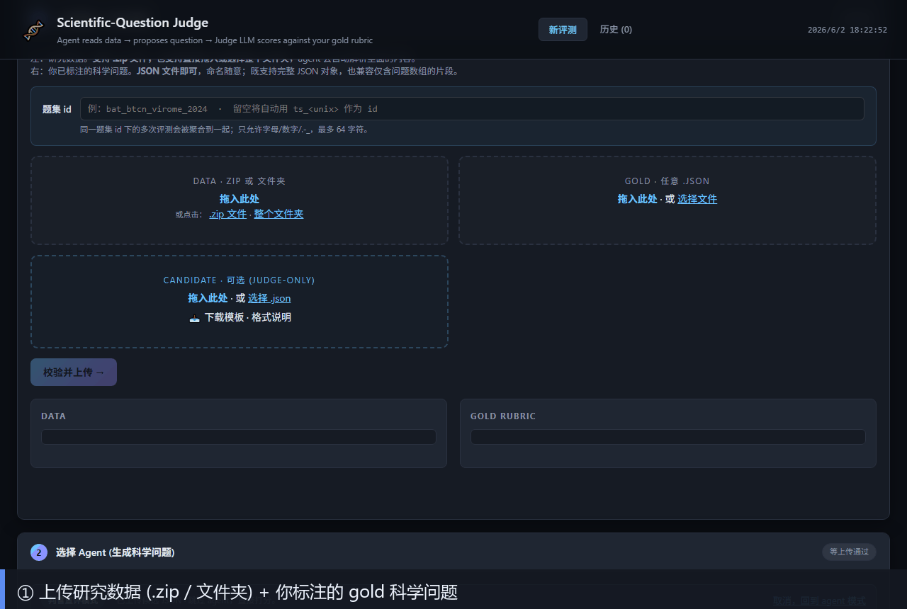

# Virus-Question-Judge

Rubric-based DeepEval judge for the **Life_Virus_001** task: an autonomous research agent reads an anonymized blind subset of a petabase-scale public-sequencing RdRP search and proposes the single most important scientific question the dataset can answer. The judge LLM scores the agent's top-1 question against a 6-dimension weighted rubric.

## 网站操作流程 / Web Console Walkthrough

可视化控制台把整条流水线拆成 5 步，下图按顺序展示每一步的界面：



| 步骤 | 操作 |
|---|---|
| ① 上传 | 拖入研究数据(`.zip` 或文件夹)+ 你标注的 gold 科学问题(`.json`)，可选填题集 id |
| ② 选 Agent | 勾选一个或多个 Agent(Claude / GPT / Gemini / Qwen / GLM …)，它们并行阅读数据并各自提问 |
| ③ 设 Judge | 选择 Judge LLM，查看 6 维加权 rubric(每维 0–5 锚点，与 judge prompt 同源) |
| ④ 实时进度 | SSE 推送 `agent_started / agent_finished / judge_finished`，时间线区分 agent 时间与 judge 时间 |
| ⑤ 看结果 | 排行榜 · 六维雷达 · 维度对比 · required_elements 覆盖 · 候选问题对比 · 时间分解 |

> GIF 由 [`webapp/make_demo_gif.py`](webapp/make_demo_gif.py) 用 Playwright 自动逐步截图合成；重新生成见下方「本地运行 webapp」。

```
agent (Qwen3.6-Plus | Codex CLI | Claude Code | …)
        │  reads
        ▼
   sandbox copy of  INSTRUCTIONS.md, checklist.json, info.json, data/raw_data/
        │  writes
        ▼
   agent_questions.json  +  report/report.md
        │
        ▼
   DeepEval custom metrics (one per rubric dimension, weighted composite)
        │  reads judge-only target_study/question_rubric.json
        ▼
   judge_scores.json
```

## 版本更新记录 / Changelog

> 远程仓库：<https://github.com/DrugD/Virus-Question-Judge>（账号 `likun9876543210@163.com`）。
> 后续改动统一同步到 **`sync-test`** 分支。

### v0.3.0 — 2026-06-02

- **数据脱敏（文件名为主）.** 上传数据进入 workspace 时被拍平并重命名为 `1.csv`、`2.json`、`3.tsv` …（只保留扩展名，丢弃目录名），原名映射写入 judge-only 的 `workspace/filename_map.json`。这样 agent 无法仅靠引用 `43059586_RdRp_motif_collection.xlsx` 之类的“暗示性文件名”白拿 data_grounding 分。详见 `webapp/pipeline_runner.py::_desensitize_data`。
- **data_grounding 评分收紧.** 仅引用文件名/变量名/accession/figure 标签视为表层引用，**不再**给高分；高分要求从数据中真正推导出统计量、分布或关系。锚点与定义见 `eval/metrics/gold_rubric_metric.py`（UI 与 judge prompt 同步）。
- **数据有效性检查.** 上传校验新增有效性检查：空文件、只有表头无数据行的表格、空 FASTA、无法解析的 JSON 会被标记为 warning，并在 `valid_file_count` 汇总；若全部文件无效则直接拒绝（`webapp/validator.py`）。
- **Pass@5 改为计数式.** 5 条候选每通过 1 条记 **+0.2**（`pass_count / 5`），与排名无关：全对 = 1.0，全错 = 0.0。取代原“位置加权 / 20”算法。涉及 `webapp/pipeline_runner.py`、`eval/rejudge.py` 及所有 agent/UI 文案。
- **不再持久化 sandbox 数据.** 每次 run 结束后自动删除 `webapp_runs/.../sandboxes/<agent>/<ts>/data/`（成功与失败路径都清理），仅保留 agent 输出与 `_debug/`。一次性清理了历史遗留的 ~1.5 GB 拷贝，并在 `.gitignore` 中排除该路径。
- **judge model 默认最强模型.** 默认 judge 固定为 **Claude Opus 4.7**（`eval/config.yaml`，当前最强档；后续可扩展为最强 n 个 LLM 的集成评审）。
- **历史结果归档（按 judge 标注）.** v0.3.0 之前的所有结果移入 `results_archive/`，并按评测所用 LLM Judge 分目录：`judge-gpt-5.1/`（旧 `results/`）、`judge-gpt-5-mini/`、`judge-gemini-2.5-flash/`、`aggregate-multi-judge/`（`STATS*` 汇总）、`judge-unjudged-agent-outputs/`（20 个仅跑 agent、未评测的 `upl_*`）。每个目录含 `JUDGE.txt` 标注 judge 模型 + 旧版 Pass@5 口径。详见 `results_archive/README.md`。旧分数为位置加权口径，**不可**与新计数式混比。
- **移除 intern-s1-mini.** 该 agent 从 `eval/agents/__init__.py` 的 `REGISTRY` / `AGENT_META` 下线，不再出现在可选 agent 列表。

## Layout

```
病毒-Question-Judge/
├── INSTRUCTIONS.md            # agent prompt (mandates the two output files)
├── checklist.json             # 6-dim rubric, agent-visible
├── info.json                  # task spec + agent_output_schema
├── files.json                 # workspace tree manifest
├── data/raw_data/             # blind-data (32 runs / 53 fragments)
├── target_study/              # JUDGE-ONLY: groundtruth + flags + anchors
│   ├── checklist.json         # byte-equal copy of root checklist.json
│   ├── question_rubric.json   # GQ_001..008 + 8 refusal flags + 10 calib anchors
│   └── README.md
├── eval/                      # DeepEval pipeline
│   ├── config.yaml            # judge LLM provider + threshold
│   ├── pyproject.toml
│   ├── requirements.txt
│   ├── run_judge.py           # score one agent-run dir
│   ├── run_pipeline.py        # end-to-end multi-agent + leaderboard
│   ├── metrics/
│   │   ├── judge_llm.py
│   │   ├── rubric_dimension_metric.py
│   │   └── rubric_composite_metric.py
│   ├── agents/
│   │   ├── base.py
│   │   ├── qwen_agent.py
│   │   ├── codex_cli_agent.py
│   │   └── claude_code_agent.py
│   └── utils/{workspace.py, schemas.py}
└── results/{agent}/{run_id}/{agent_questions.json, report/report.md, judge_scores.json}
```

## Why DeepEval + custom Metric (and not exact-match / single GEval)

- **Per-dimension transparency.** Every rubric row in `checklist.json` becomes one `RubricDimensionMetric`. The judge LLM is asked one focused question per call (which 0–5 anchor matches the candidate?), so we get six independent reasoning traces instead of one opaque "good/bad" verdict.
- **Weighted aggregation with refusal caps.** `RubricCompositeMetric` weight-averages the six dimensions, then applies caps from `target_study/question_rubric.json#refusal_flags` (e.g. forbidden-entity leak caps `question_matching` at 1; missing top question zeroes everything). Exact-match would miss all of this.
- **Calibration anchors.** `target_study/question_rubric.json#calibration_anchors` ships 10 worked examples (perfect / strong / generic / wrong-direction / unrelated / …) so the judge LLM is anchored to consistent score floors and ceilings instead of drifting.
- **Pluggable judge.** `JudgeLLM` speaks OpenAI, DashScope/Qwen (OpenAI-compatible), and Anthropic, so the same metric stack runs against GPT-5, Claude Opus 4.7, or Qwen3.6-Plus without code changes.

## Quickstart

```bash
# 1. install
cd eval
pip install -r requirements.txt

# 2. set credentials (only the ones you intend to use)
export OPENAI_API_KEY=...           # judge default in config.yaml
export DASHSCOPE_API_KEY=...        # for Qwen3.6-Plus agent
export ANTHROPIC_API_KEY=...        # only if Claude Code uses an API key

# 3. end-to-end: run all three agents, judge, leaderboard
cd ..
python -m eval.run_pipeline \
  --workspace . \
  --agents qwen3.6-plus codex-cli claude-code \
  --judge-config eval/config.yaml

# 4. judge an existing agent-run dir
python -m eval.run_judge \
  --workspace . \
  --agent-output results/qwen3.6-plus/20260516T101010 \
  --judge-config eval/config.yaml
```

## 本地运行 webapp / Run the Web Console

```bash
# 1. 建虚拟环境并装依赖
python -m venv .venv
.venv/Scripts/python.exe -m pip install -r requirements.txt   # Windows
# source .venv/bin/activate && pip install -r requirements.txt # macOS/Linux

# 2. 启动服务器(Windows 必须加 PYTHONUTF8=1，否则 GBK 解码 UTF-8 配置会崩)
PYTHONUTF8=1 .venv/Scripts/python.exe -m uvicorn webapp.server:app --host 127.0.0.1 --port 8765

# 3. 浏览器打开
#    http://127.0.0.1:8765/

# 4. (可选) 重新生成操作流程 GIF —— 需服务器已在 :8765 运行
PYTHONUTF8=1 .venv/Scripts/python.exe webapp/make_demo_gif.py
```

> 真正跑评测需要 `.env` 里有有效的 `NEWAPI_KEY`(裁判 LLM 密钥)；若为占位符 `sk-xxx`，界面可浏览但 run 会失败。

## Adding a new agent

1. Subclass `eval.agents.base.AgentRunner`, set `agent_id`, implement `_invoke(self, sandbox)`.
2. Register it in `eval/agents/__init__.py::REGISTRY`.
3. Pass `--agents <your_id>` to `run_pipeline.py`.

The base class handles sandbox creation (only agent-visible files copied — `target_study/` is never exposed), output validation against `info.json#/agent_output_schema`, and timing.

## Output

`results/{agent}/{run_id}/judge_scores.json`:

```jsonc
{
  "composite_score": 0.78,            // 0..1 weighted average (after caps)
  "composite_score_raw": 3.9,         // 0..5 weighted average
  "passed": true,                     // composite_score >= threshold
  "threshold": 0.6,
  "refusal_triggered": false,
  "flags_hit": [],
  "dimensions": [
    {
      "id": "question_matching",
      "weight": 0.4,
      "raw_score": 4,
      "normalized": 0.8,
      "capped_raw": 4,
      "capped_normalized": 0.8,
      "flags": [],
      "reasoning": "Hits archive-scale + RdRP + ref-DB gap; misses 'petabase' wording."
    },
    /* novelty, importance, testability, data_support, specificity */
  ],
  "candidate": { /* the agent's top question */ },
  "agent_id": "qwen3.6-plus",
  "judge_model": "claude-opus-4-7",
  "judge_provider": "openai"
}
```
